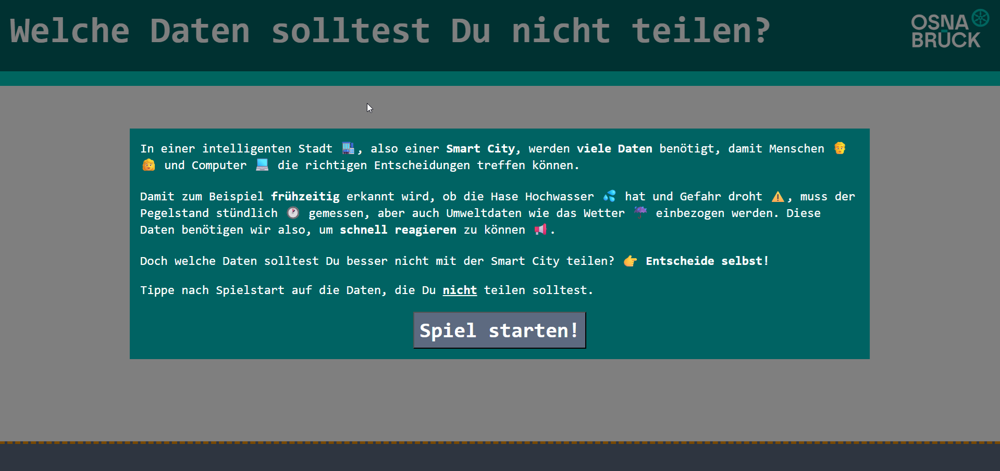
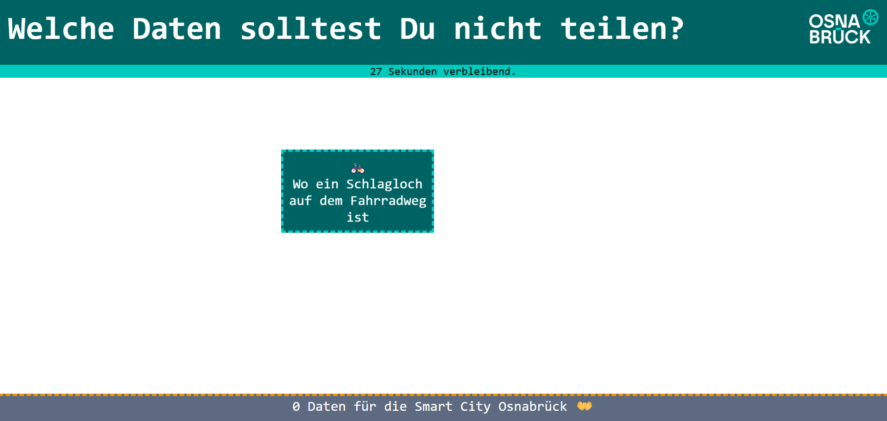
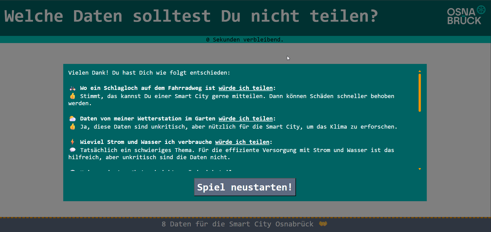

# Data Game

A simple browser-based game built with **HTML, CSS, and jQuery**.  
Blocks fall from the top of the screen, and the player must click them before they disappear.  
The game is fully configurable via a JSON file.

---

## Features

- 🕹️ Interactive block-clicking gameplay  
- ⏱️ Configurable time limit and block fall speed  
- 🎨 Customizable blocks, styles, and branding  
- 🔊 Support for custom sounds and fonts  
- 📱 Works in modern browsers, no installation required  

---

## Getting Started

### Prerequisites
Any modern web browser (Chrome, Firefox, Edge, Safari)  

### Installation
1. Clone this repository or download the ZIP
2. Upload it to your web server (because of CORS problems the game will not work locally)
3. Call index.html 

## Configuration
The game can be customized via custom/config.json:
`{
  "title": "My game",
  "startText": "Click the button to start!",
  "startButton": "Start",
  "resultText": "Game Over!",
  "timeLimit": 30,
  "blockInterval": 2000,
  "blockFallTime": 5000,
  "blocks": [
    { "label": "😀" },
    { "label": "🚀" },
    { "label": "💡" }
  ]
}`

- title → Page and brand title
- startText → Message shown on start overlay
- startButton → Button text to begin the game
- resultText → Message shown when game ends
- timeLimit → Maximum time in seconds
- blockInterval → Interval (ms) between new blocks appearing
- blockFallTime → Time (ms) for a block to fall to the bottom
- blocks → Array of objects defining block labels

## More customization
- 🎨 Styling → Modify custom/styles.css
- 🔊 Sound → Replace custom/sound.mp3 with your own sound file
- 🖼️ Logo → Replace custom/logo.svg
- 🔤 Font → Replace custom/font.ttf

